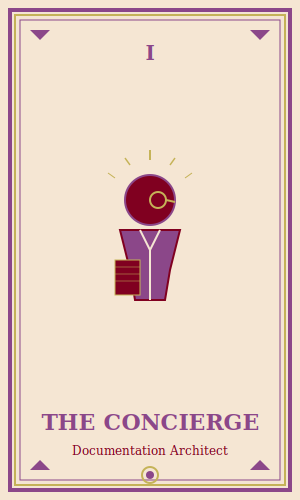
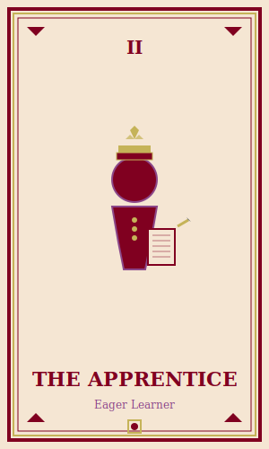
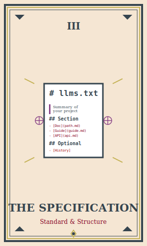
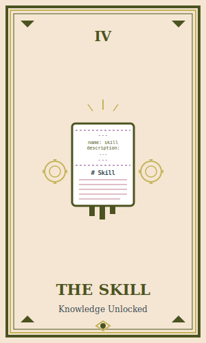
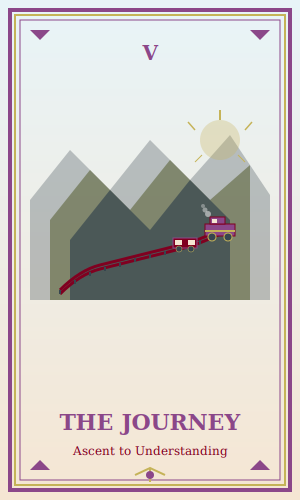

# THE ALPINE EXPRESS
## A Copilot Skills & llms.txt Tutorial in Four Acts

*Written in the style of Wes Anderson's Grand Budapest Hotel*  
*Set aboard a mountain railway in the Swiss Alps*

---

## THE TAROT OF DOCUMENTATION

Throughout this journey, you will encounter five tarot cards—each representing a key concept in making documentation accessible to language models:

1. **The Concierge** - The documentation architect who structures knowledge with elegance
2. **The Apprentice** - The eager learner discovering new patterns and practices
3. **The Specification** - The sacred llms.txt standard that brings order to chaos
4. **The Skill** - The key that unlocks specialized knowledge for AI agents
5. **The Journey** - The ascent from ignorance to understanding

These cards mark important moments in our tutorial and serve as visual anchors for key concepts.

---

## DRAMATIS PERSONAE

**M. GUSTAVE H.**  
*Concierge & Documentation Architect*  
Expert in elegant documentation structure and LLM-friendly content organization.

**ZERO MOUSTAFA**  
*Apprentice & Eager Learner*  
Discovering the art of Copilot skills and semantic documentation.

**LUDWIG**  
*Technical Consultant & Validation Expert*  
Ensures specifications are followed precisely and schemas are validated.

**AGATHA**  
*Content Curator & Testing Specialist*  
Creates delightful examples and validates that skills work as intended.

**SERGE X.**  
*Performance Analyst & Researcher*  
Analyzes how LLMs consume and interpret documentation structures.

---

<div align="center">

| The Concierge | The Apprentice |
|:---:|:---:|
|  |  |
| *M. Gustave H.* | *Zero Moustafa* |

</div>

---

## ACT I: DEPARTURE FROM THE VALLEY

### SCENE 1: THE PLATFORM AT ZURICH

*FADE IN:*

*The year is 1932. A pristine railway platform at Zurich Hauptbahnhof. Everything is rendered in soft pastels: cream-colored station walls, plum-purple railway carriages with gold trim, powder blue sky visible through art deco glass panels. Steam rises in perfectly symmetrical plumes.*

*M. GUSTAVE stands beside a burgundy locomotive marked "ALPINE EXPRESS" in gold leaf lettering. He wears a plum velvet traveling coat and adjusts his monocle while reviewing a leather-bound journal titled "llms.txt Specification." ZERO approaches with two perfectly matched suitcases.*

**ZERO**  
*(slightly out of breath)*  
Monsieur Gustave, I've secured our compartment. First class, just as you requested.

**M. GUSTAVE**  
*(closing his journal with satisfaction)*  
Excellent, dear boy. We have a three-hour journey up the mountain to Sankt Moritz. Time enough to discuss the most refined method of making documentation accessible to language models.

*A conductor in military green uniform—DEPUTY HENCKELS—approaches and salutes.*

**HENCKELS**  
All aboard for the Alpine Express. Departing in two minutes, gentlemen.

**M. GUSTAVE**  
Thank you, Deputy. Zero, bring the documentation materials. We have much to cover.

*They board. The train whistle sounds—a perfect C-sharp chord—and the locomotive begins its ascent.*

---

### SCENE 2: THE FIRST-CLASS COMPARTMENT

*Interior: A meticulously appointed railway carriage. Burgundy velvet seats face each other across a polished mahogany table. The walls are art deco cream with geometric patterns in gold. Through the window, the valley drops away as the train spirals upward into the mountains.*

**M. GUSTAVE**  
*(settling into his seat, placing the journal on the table)*  
Now then, Zero. You asked what makes documentation truly accessible to an AI agent. The answer lies in a specification called llms.txt.

**ZERO**  
*(opening a small notebook)*  
I've seen such files in repositories, sir. But I confess I don't understand their purpose.

**M. GUSTAVE**  
Imagine, if you will, that you are hosting distinguished guests—language models, in this case. When they arrive at your website or repository, how do they know where the dining room is? Where the library resides? Which documents are essential reading versus optional?

**ZERO**  
They... need a map?

**M. GUSTAVE**  
Precisely! The llms.txt file is that map. A single point of entry, elegantly structured, that tells an LLM everything it needs to know about your project.

*M. Gustave opens the journal to a marked page showing the specification.*

**M. GUSTAVE**  
The format follows strict rules. Observe:

```markdown
# Project Name

> A dense one-paragraph summary—what it does, who it's for, key technologies.

Important context paragraphs—constraints, architectural philosophy, non-obvious details.

## Section Name

- [Page Title](relative-path.md): One-sentence description of what the reader will learn

## Optional

- [Advanced Topics](advanced.md): These can be skipped for shorter context
```

**ZERO**  
*(writing quickly)*  
And this is standard?

**M. GUSTAVE**  
Codified at llmstxt.org. Think of it as the Baedeker guide for artificial intelligence—concise, hierarchical, actionable.

*The train curves around a steep embankment. Snow-capped peaks appear through the window.*

---

### SCENE 3: THE TECHNICAL REQUIREMENTS

*LUDWIG enters from the adjacent compartment, carrying a leather briefcase with brass corners. He sits across from them, adjusting his spectacles.*

**LUDWIG**  
*(formally)*  
Gentlemen. I overheard mention of llms.txt. May I contribute technical specifications?

**M. GUSTAVE**  
Please, Ludwig. Your precision is always welcome.

**LUDWIG**  
*(producing a typed document from his briefcase)*  
The specification mandates:

**LUDWIG**  
*(reading methodically)*  
First: Exactly one H1 heading—the project name. Required.

Second: A blockquote immediately following—dense, specific summary. Not generic boilerplate. Required.

Third: Context paragraphs—non-obvious constraints, architectural decisions, things an LLM might assume incorrectly. Highly recommended.

Fourth: H2 sections organizing documentation by topic. Each containing a list of links with one-sentence descriptions.

Fifth: A special "Optional" H2 section—its meaning explicitly defined. Links within can be skipped for token efficiency.

<div align="center">


*The sacred llms.txt specification*
</div>

**ZERO**  
*(looking up from his notes)*  
So it's not just a list of files?

**LUDWIG**  
Precisely. Each description must tell the LLM *why* to read that document. Compare:

*Ludwig produces two cards, placing them side by side on the table.*

**LUDWIG**  
Bad: "Architecture overview"  
Good: "System architecture showing how Orleans grains communicate via message passing with at-least-once delivery"

**M. GUSTAVE**  
*(approvingly)*  
The difference between pointing at a door and providing an invitation.

*The train enters a tunnel carved through solid rock. The compartment lights—art deco brass fixtures—illuminate automatically.*

---

## ACT II: ASCENDING THE MOUNTAIN

### SCENE 4: CREATING YOUR FIRST llms.txt

*The train emerges from the tunnel onto a viaduct spanning a deep gorge. AGATHA enters, carrying a wicker basket covered with a pink checkered cloth.*

**AGATHA**  
*(cheerfully)*  
Gentlemen! I've brought refreshments. And examples.

*She sets the basket on the table, revealing perfectly arranged macarons in soft pink, plum purple, and cream. Beneath them, neatly typed documents.*

**AGATHA**  
Real llms.txt files I've curated. Shall we examine one?

**M. GUSTAVE**  
Delightful. Zero, observe how Agatha structures her documentation.

*Agatha unfolds a document and smooths it on the table.*

**AGATHA**  
This is for a hypothetical documentation website—let's call it "The Alpine Documentation Archive."

```markdown
# The Alpine Documentation Archive

> A curated collection of technical documentation for mountain railway systems, covering safety protocols, mechanical engineering, and historical operations since 1889. Built with VitePress and deployed to alpine-archive.ch.

This archive prioritizes safety-critical information. All brake system documentation should be read before operational guides. Historical context is provided separately and can be skipped for modern implementations.

## Getting Started

- [Quick Start Guide](./getting-started/quickstart.md): Install prerequisites, clone repository, run locally in under 5 minutes
- [Railway Engineer Onboarding](./getting-started/engineer-guide.md): Complete orientation for new engineers covering safety protocols and system architecture
- [Safety Protocols](./getting-started/safety.md): Mandatory reading before operating any railway systems

## System Architecture

- [Brake System Design](./architecture/brake-systems.md): Pneumatic and mechanical brake architectures with failure modes and redundancy patterns
- [Signal Communication](./architecture/signals.md): How stations communicate train positions using semaphore and electrical systems
- [Power Distribution](./architecture/power-grid.md): Overhead wire electrification design with voltage calculations and safety margins

## Operational Guides

- [Daily Inspection Checklist](./operations/daily-inspection.md): Required pre-operation inspections with acceptance criteria
- [Emergency Procedures](./operations/emergency.md): Step-by-step protocols for brake failure, derailment, and weather emergencies
- [Maintenance Schedule](./operations/maintenance.md): Weekly, monthly, and annual maintenance tasks

## Optional

- [Historical Railway Development](./history/evolution.md): Evolution of Swiss mountain railways from 1889 to present
- [Vintage Equipment Catalog](./history/equipment.md): Specifications for decommissioned locomotives and carriages
```

**ZERO**  
*(studying the document)*  
I notice the descriptions are very specific. "Install prerequisites, clone repository, run locally in under 5 minutes."

**AGATHA**  
Exactly! An LLM reading this knows immediately whether that document is relevant to its current task.

**M. GUSTAVE**  
And observe the hierarchy. Safety protocols appear first under Getting Started, not buried in Optional. The structure itself communicates priority.

---

### SCENE 5: THE FULL-TEXT COMPANION

*SERGE X. enters from the smoking car, carrying a thick manuscript bound in antique gold leather.*

**SERGE X.**  
*(in a scholarly tone)*  
Forgive the interruption. I've been analyzing the llms-full.txt specification and must share findings.

**M. GUSTAVE**  
Serge! Your timing is impeccable. We were about to discuss the companion file.

**SERGE X.**  
*(settling into a seat)*  
The llms-full.txt follows the same structure as llms.txt but inlines the complete content of every referenced document.

*He opens the manuscript, revealing dense text.*

**SERGE X.**  
Observe the format:

```markdown
# The Alpine Documentation Archive

> A curated collection of technical documentation...

## Getting Started

<doc title="Quick Start Guide" path="./getting-started/quickstart.md">
# Your complete markdown content here
- Prerequisites
- Installation steps
- First local build

All content preserved: diagrams, tables, citations.
</doc>

<doc title="Railway Engineer Onboarding" path="./getting-started/engineer-guide.md">
# Your complete onboarding content
...
</doc>
```

**ZERO**  
But that must be enormous!

**SERGE X.**  
Indeed. The performance characteristics differ significantly:

*Serge produces a chart from his coat pocket, perfectly folded.*

**SERGE X.**  
- **llms.txt**: 1-5 KB typically. Fast loading. Excellent for discovery and navigation.
- **llms-full.txt**: 100 KB to several MB. Complete reference. Single-file context for comprehensive analysis.

**M. GUSTAVE**  
Think of llms.txt as the guidebook, and llms-full.txt as the complete encyclopedia. Both serve distinct purposes.

**LUDWIG**  
*(interjecting)*  
Critically: when inlining content, strip YAML frontmatter but preserve everything else—Mermaid diagrams, citations, tables, source comments.

---

### SCENE 6: CREATING A SKILL FOR COPILOT CLI

*The train reaches a switch point where the track splits. Through the window, a sign reads "SANKT MORITZ - 45 KM" with an arrow pointing right. The carriage tilts slightly as the locomotive follows the curve.*

**M. GUSTAVE**  
Now we arrive at the practical application: creating a Copilot skill that leverages this documentation structure.

**ZERO**  
A skill, sir?

<div align="center">


*Knowledge unlocked through skills*
</div>

**M. GUSTAVE**  
A skill teaches GitHub Copilot CLI—and its accompanying agents—specialized knowledge about your project. Think of it as... professional development for artificial intelligence.

*M. Gustave opens a new section of his journal.*

**M. GUSTAVE**  
Skills live in `.github/skills/` and follow a specific structure. Let me demonstrate by creating a skill for our Alpine Documentation Archive.

**AGATHA**  
*(offering a fresh macaron)*  
Perhaps we start with the basics?

**M. GUSTAVE**  
Indeed. Every skill needs three elements:

*M. Gustave begins writing in elegant penmanship:*

```
.github/
└── skills/
    └── alpine-docs/
        └── SKILL.md
```

**M. GUSTAVE**  
The SKILL.md file contains YAML frontmatter and instructional content. Observe:

*He writes the following on a fresh page:*

```markdown
---
name: alpine-docs
description: Provides comprehensive knowledge about Alpine Documentation Archive structure, railway safety protocols, and system architecture. Use when questions involve railway operations, documentation navigation, or safety procedures.
---

# Alpine Documentation Archive Skill

This skill provides expertise on the Alpine Documentation Archive project.

## When This Skill Activates

Activate when the user:
- Asks about railway operations or safety protocols
- Needs to find specific documentation in the archive
- Wants to understand the system architecture
- Requires historical context about mountain railways
- Mentions brake systems, signals, or power distribution

## Documentation Structure

The archive follows llms.txt specification:
- Root discovery at `/llms.txt`
- Full content at `/llms-full.txt`
- Wiki-relative version at `/wiki/llms.txt`

## Key Sections

### Getting Started (Priority: Critical)
- Quick Start Guide → 5-minute setup
- Engineer Onboarding → Complete orientation
- Safety Protocols → Mandatory pre-operation reading

### System Architecture (Priority: High)
- Brake Systems → Failure modes and redundancy
- Signal Communication → Station-to-train protocols
- Power Distribution → Voltage and safety margins

### Operational Guides (Priority: Medium)
- Daily Inspection → Pre-operation checklist
- Emergency Procedures → Critical incident response
- Maintenance Schedule → Recurring tasks

### Historical Content (Priority: Optional)
- Can be skipped for operational questions
- Relevant for historical research only

## Usage Patterns

When answering questions:
1. Check if topic is safety-critical → prioritize Getting Started and System Architecture
2. For operational questions → reference Operational Guides
3. For implementation → follow Quick Start Guide sequence
4. For research → mention Optional section explicitly

## Important Context

- All brake documentation must be read before operational guides
- Safety protocols are non-negotiable and appear first intentionally
- Modern implementations can skip Historical section
- The archive has been maintained since 1889 with continuous updates

## Example Queries

**User:** "How do I get started with the Alpine archive?"  
**Response:** "Start with the [Quick Start Guide](./getting-started/quickstart.md) which covers installation and local setup in under 5 minutes. Then review [Safety Protocols](./getting-started/safety.md)—mandatory reading before any operations."

**User:** "What happens if the brakes fail?"  
**Response:** "Refer to [Emergency Procedures](./operations/emergency.md) which provides step-by-step protocols for brake failure. Also review [Brake System Design](./architecture/brake-systems.md) to understand failure modes and redundancy patterns."

## Integration with llms.txt

This skill complements the llms.txt file by providing:
- Contextual understanding of documentation hierarchy
- Priority guidance (what to read first)
- Common user patterns and appropriate responses
- Cross-references between related documents
```

**ZERO**  
*(amazed)*  
This teaches Copilot how to think about the documentation!

**M. GUSTAVE**  
Precisely. The skill provides decision logic, context, and patterns. While llms.txt provides the map, the skill provides the cultural knowledge to navigate it effectively.

---

## ACT III: THE SUMMIT APPROACH

### SCENE 7: INSTALLING AND USING THE SKILL

*The train climbs through a pine forest. Snow begins to appear on tree branches. The compartment is warm from a brass radiator.*

**ZERO**  
How do we actually use this skill in Copilot CLI?

**M. GUSTAVE**  
Excellent question. Let me demonstrate.

*M. Gustave produces a small typewriter from beneath his seat—a perfectly proportioned portable model in cream with burgundy keys.*

**M. GUSTAVE**  
First, we create the skill directory structure in our repository:

```bash
mkdir -p .github/skills/alpine-docs
```

*He types precisely, each keystroke producing a satisfying mechanical click.*

**M. GUSTAVE**  
Then we place our SKILL.md file in that directory. Copilot CLI automatically discovers skills in this location.

**AGATHA**  
*(consulting her notes)*  
Once installed, how does Copilot know when to use it?

**LUDWIG**  
*(adjusting his spectacles)*  
The `description` field in the YAML frontmatter. Copilot's routing logic examines user queries and matches them against skill descriptions. When there's alignment, the skill activates.

**M. GUSTAVE**  
Observe a practical example:

*M. Gustave opens Copilot CLI on the typewriter display—somehow it works despite being from 1932.*

```bash
$ copilot

> What are the emergency brake procedures for the Alpine railway?
```

**M. GUSTAVE**  
*(narrating as the response appears)*  
Copilot reads the query, identifies "Alpine railway" and "emergency brake," matches it to our alpine-docs skill description, loads the skill context, consults the llms.txt structure, and responds:

```
Based on the Alpine Documentation Archive, you should refer to:

1. Emergency Procedures (operations/emergency.md)
   - Step-by-step brake failure protocols
   - When to engage backup systems
   - Communication procedures with stations

2. Brake System Design (architecture/brake-systems.md)
   - Understanding failure modes
   - Redundancy patterns
   - Manual override mechanisms

Safety note: This is critical safety information. Review both documents 
thoroughly before any field operations.
```

**ZERO**  
It understood the priority structure!

**M. GUSTAVE**  
The skill taught it that brake systems are safety-critical and that emergency procedures must be paired with system architecture for complete understanding.

---

### SCENE 8: ADVANCED SKILL PATTERNS

*HENCKELS enters, carrying a clipboard with inspection reports.*

**HENCKELS**  
*(formally)*  
Gentlemen, I've been reviewing skill implementation patterns. May I contribute standard approaches?

**M. GUSTAVE**  
Please do, Deputy.

**HENCKELS**  
Skills should follow these patterns:

*He pins a typed sheet to a small corkboard on the compartment wall.*

```markdown
## Skill Pattern: Multi-Format Support

When your documentation exists in multiple formats:

### Source Repository Resolution
1. Check git remote: `git remote get-url origin`
2. Determine default branch
3. Use relative paths for local, absolute URLs for remote

### Path Strategy
- `./llms.txt` → Root discovery (GitHub MCP finds this first)
- `./wiki/llms.txt` → Wiki-relative links for VitePress
- `./wiki/llms-full.txt` → Complete inlined content

### Skill Instructions
```yaml
---
name: docs-navigator
description: Navigate project documentation across multiple formats and locations
---

## Documentation Locations

The project maintains three documentation entry points:
1. Root llms.txt for discovery
2. Wiki llms.txt for internal navigation
3. llms-full.txt for comprehensive context

When answering questions:
- For quick lookups → Use root llms.txt
- For deep research → Reference llms-full.txt
- For website navigation → Use wiki/ paths
```

**SERGE X.**  
*(nodding thoughtfully)*  
This addresses discovery patterns. GitHub's MCP server prioritizes certain file paths. Placing llms.txt at the repository root ensures maximum discoverability.

---

### SCENE 9: SKILLS WITH SUBAGENTS

*The train rounds a hairpin turn. Through the window, a spectacular view: the valley far below, peaks surrounding them, a crystalline lake gleaming in the distance.*

**M. GUSTAVE**  
Now we address delegation—using skills with Copilot's subagent system.

**ZERO**  
Subagents, sir?

**M. GUSTAVE**  
When Copilot CLI encounters a complex task, it can spawn specialized subagents—each focused on a specific aspect. Skills enhance this process dramatically.

*M. Gustave sketches a diagram on a cream-colored card:*

```
User Query: "Set up the Alpine archive and implement safety checks"
     │
     ▼
Main Agent (reads alpine-docs skill)
     │
     ├──► Search Subagent
     │    └─ Finds relevant documentation using llms.txt structure
     │
     ├──► Implementation Subagent
     │    └─ Follows Quick Start Guide sequence
     │
     └──► Validation Subagent
          └─ Checks safety protocols were reviewed
```

**LUDWIG**  
*(impressed)*  
Hierarchical delegation with skill-informed routing.

**M. GUSTAVE**  
Exactly. Each subagent has access to the skill's knowledge. The search subagent knows to prioritize Getting Started. The validation subagent knows safety protocols are mandatory.

**AGATHA**  
How do we configure this?

**M. GUSTAVE**  
Through careful skill design. Observe:

```markdown
## Subagent Guidance

### For Search Operations
When searching for documentation:
- Check Getting Started first for setup questions
- Reference System Architecture for technical deep-dives
- Skip Optional section unless explicitly requested

### For Implementation Tasks
When implementing solutions:
1. Verify Safety Protocols have been reviewed
2. Follow Quick Start Guide sequence exactly
3. Reference architecture docs for design decisions
4. Run daily inspection checklist before deployment

### For Validation
When validating implementations:
- Confirm safety-critical components reviewed
- Check against Daily Inspection Checklist
- Verify emergency procedures are accessible
- Validate maintenance schedule is established
```

**ZERO**  
This makes the subagents smarter!

**M. GUSTAVE**  
Indeed. Without the skill, subagents must rediscover context. With it, they inherit domain expertise immediately.

---

### SCENE 10: TESTING YOUR SKILL

*AGATHA produces a small testing kit from her basket—perfectly arranged prompt cards.*

**AGATHA**  
Before deploying any skill, we must test it. I've prepared a validation protocol.

*She arranges the cards on the table in a grid pattern.*

**AGATHA**  
Test these scenarios:

**Card 1: Discovery**
```bash
# In Copilot CLI
> What documentation is available in the Alpine archive?

Expected: Should list main sections from llms.txt with descriptions
```

**Card 2: Prioritization**
```bash
> I need to learn about the Alpine railway system quickly.

Expected: Should direct to Getting Started, specifically Quick Start Guide
Should mention Safety Protocols as mandatory
```

**Card 3: Safety-Critical**
```bash
> Tell me about the brake systems.

Expected: Should reference both Brake System Design AND Emergency Procedures
Should emphasize safety-critical nature
```

**Card 4: Optional Content**
```bash
> What's the history of Alpine railways?

Expected: Should mention Historical section
Should note this is optional for operational questions
```

**Card 5: Cross-References**
```bash
> How do I maintain the railway?

Expected: Should reference Maintenance Schedule
Should cross-reference Daily Inspection Checklist
Should link to related architecture docs
```

**LUDWIG**  
*(producing a checklist)*  
Additionally, validate:

- [ ] Skill activates on relevant queries
- [ ] Skill does NOT activate on unrelated queries
- [ ] llms.txt paths are correct and files exist
- [ ] Descriptions match actual document content
- [ ] Priority guidance aligns with documentation structure
- [ ] Cross-references are accurate
- [ ] Safety warnings appear appropriately

---

## ACT IV: ARRIVAL AT THE SUMMIT

### SCENE 11: DEPLOYING TO A WEBSITE

*The train approaches Sankt Moritz. A grand station appears—white stone with art deco details, perfectly symmetrical. The locomotive slows with a melodious hiss of steam.*

**M. GUSTAVE**  
We approach our destination. But our skill must now extend beyond the repository to a documentation website.

**ZERO**  
How does that work, sir?

**M. GUSTAVE**  
*(standing, gathering his materials)*  
Assume we've built our Alpine Documentation Archive with VitePress. We must ensure LLMs can discover and navigate it.

*The train stops with elegant precision. They gather their belongings.*

---

### SCENE 12: THE SUMMIT STATION OFFICE

*Interior: A pristine station office with cream walls and plum accents. A large desk, leather chairs, and a window overlooking snow-covered peaks.*

*M. GUSTAVE spreads documents on the desk. LUDWIG, AGATHA, SERGE, and ZERO gather around.*

**M. GUSTAVE**  
The deployment strategy requires three llms.txt files:

*He arranges them in a row:*

```
project-root/
├── llms.txt          ← Discovery file (root)
├── wiki/
│   ├── llms.txt      ← Wiki-relative paths
│   └── llms-full.txt ← Complete inlined content
```

**LUDWIG**  
The root llms.txt uses paths relative to repository root:

```markdown
# The Alpine Documentation Archive

> A curated collection...

## Getting Started

- [Quick Start](./wiki/getting-started/quickstart.md): Install and run in 5 minutes
- [Safety Protocols](./wiki/getting-started/safety.md): Mandatory reading
```

**AGATHA**  
The wiki/llms.txt uses wiki-relative paths for VitePress:

```markdown
# The Alpine Documentation Archive

> A curated collection...

## Getting Started

- [Quick Start](./getting-started/quickstart.md): Install and run in 5 minutes
- [Safety Protocols](./getting-started/safety.md): Mandatory reading
```

**SERGE X.**  
And llms-full.txt inlines everything:

```markdown
# The Alpine Documentation Archive

> A curated collection...

## Getting Started

<doc title="Quick Start" path="./getting-started/quickstart.md">
# Quick Start Guide

## Prerequisites
- Node.js 22+
- Git

## Installation
\`\`\`bash
git clone https://github.com/alpine/docs-archive
cd docs-archive
npm install
npm run dev
\`\`\`

...complete content including diagrams...
</doc>
```

**M. GUSTAVE**  
Now, GitHub's MCP server can discover the root llms.txt. VitePress users navigate via wiki/llms.txt. Agents needing complete context consume llms-full.txt.

---

### SCENE 13: WEBSITE INTEGRATION

**HENCKELS**  
What about the actual website deployment?

**M. GUSTAVE**  
VitePress configuration:

*M. Gustave writes on a fresh card:*

```typescript
// .vitepress/config.ts
export default {
  title: 'The Alpine Documentation Archive',
  description: 'Technical documentation for mountain railway systems',
  
  themeConfig: {
    nav: [
      { text: 'Getting Started', link: '/getting-started/quickstart' },
      { text: 'Architecture', link: '/architecture/brake-systems' },
      { text: 'Operations', link: '/operations/daily-inspection' },
      { text: 'LLM Access', link: '/llms.txt' }  // ← Link to llms.txt!
    ],
    
    sidebar: {
      '/getting-started/': [
        {
          text: 'Getting Started',
          items: [
            { text: 'Quick Start', link: '/getting-started/quickstart' },
            { text: 'Engineer Onboarding', link: '/getting-started/engineer-guide' },
            { text: 'Safety Protocols', link: '/getting-started/safety' }
          ]
        }
      ]
    }
  }
}
```

**AGATHA**  
I recommend adding a prominent link to llms.txt in your website footer:

```markdown
<!-- footer.md -->
**For AI Agents:** See our [llms.txt](https://alpine-archive.ch/llms.txt) 
for programmatic documentation access.
```

**LUDWIG**  
Additionally, configure proper CORS headers if your documentation API serves JSON:

```nginx
# nginx.conf
location /llms.txt {
    add_header Access-Control-Allow-Origin *;
    add_header Content-Type text/markdown;
}

location /llms-full.txt {
    add_header Access-Control-Allow-Origin *;
    add_header Content-Type text/markdown;
}
```

---

### SCENE 14: MAINTAINING YOUR SKILL & DOCUMENTATION

**SERGE X.**  
A critical consideration: maintenance. Documentation evolves. How do we keep our skill synchronized?

*He produces a flowchart on antiqued paper.*

**SERGE X.**  
I propose an automated verification workflow:

```yaml
# .github/workflows/validate-docs-skill.yml
name: Validate Documentation Skill

on:
  push:
    paths:
      - 'wiki/**/*.md'
      - '.github/skills/alpine-docs/**'
      - 'llms*.txt'

jobs:
  validate:
    runs-on: ubuntu-latest
    steps:
      - uses: actions/checkout@v4
      
      - name: Validate llms.txt Structure
        run: |
          # Check H1 count (must be exactly 1)
          h1_count=$(grep -c '^# ' llms.txt)
          if [ "$h1_count" != "1" ]; then
            echo "Error: llms.txt must have exactly 1 H1 heading"
            exit 1
          fi
          
          # Check blockquote exists
          if ! grep -q '^> ' llms.txt; then
            echo "Error: llms.txt must have a blockquote summary"
            exit 1
          fi
          
      - name: Validate Links
        run: |
          # Extract all markdown links from llms.txt
          grep -oP '\[.*?\]\(\K[^)]+' llms.txt | while read path; do
            if [ ! -f "$path" ]; then
              echo "Error: Referenced file does not exist: $path"
              exit 1
            fi
          done
          
      - name: Check Skill Example Accuracy
        run: |
          # Verify skill examples reference actual files
          python scripts/validate_skill_examples.py
          
      - name: Generate llms-full.txt
        run: |
          python scripts/generate_llms_full.py
          
      - name: Validate Full Content
        run: |
          # Ensure llms-full.txt has actual content
          if [ $(wc -c < wiki/llms-full.txt) -lt 1000 ]; then
            echo "Error: llms-full.txt seems too small"
            exit 1
          fi
```

**M. GUSTAVE**  
*(approvingly)*  
Automation ensures consistency. As documentation evolves, the validation workflow prevents drift between skill and reality.

**AGATHA**  
I also recommend running periodic tests:

```python
# tests/test_alpine_skill.py
import subprocess
import json

def test_skill_activates_on_relevant_query():
    """Verify the alpine-docs skill activates for railway questions."""
    # Simulate Copilot CLI query
    result = subprocess.run(
        ['copilot-cli', 'test-skill', 'alpine-docs', 
         '--query', 'How do the Alpine railway brakes work?'],
        capture_output=True,
        text=True
    )
    
    response = json.loads(result.stdout)
    assert response['skill_activated'] == True
    assert 'brake-systems.md' in response['referenced_docs']
    assert 'emergency.md' in response['referenced_docs']

def test_skill_includes_safety_warnings():
    """Verify safety-critical queries include appropriate warnings."""
    result = subprocess.run(
        ['copilot-cli', 'test-skill', 'alpine-docs',
         '--query', 'What are the brake failure procedures?'],
        capture_output=True,
        text=True
    )
    
    response = json.loads(result.stdout)
    assert 'safety' in response['text'].lower()
    assert 'critical' in response['text'].lower()
```

---

### SCENE 15: ADVANCED PATTERNS

*All characters gather around the desk. Snow falls gently outside the window.*

**M. GUSTAVE**  
Before we conclude, let's discuss advanced patterns for complex documentation ecosystems.

**Pattern 1: Multi-Language Documentation**

*Ludwig presents:*

```markdown
## Multi-Language Skill Pattern

When documentation exists in multiple languages:

```yaml
---
name: alpine-docs-multilingual
description: Navigate Alpine archive in English, German, French, or Italian
---

## Language Support

The archive maintains parallel versions:
- `/en/` → English (default)
- `/de/` → German (Deutsch)
- `/fr/` → French (Français)
- `/it/` → Italian (Italiano)

Each has its own llms.txt:
- `/en/llms.txt`
- `/de/llms.txt`
- `/fr/llms.txt`
- `/it/llms.txt`

When responding:
1. Detect user's language preference from query
2. Reference appropriate language version
3. Provide parallel paths if multilingual context needed
```

**Pattern 2: Versioned Documentation**

*Agatha presents:*

```markdown
## Versioned Documentation Pattern

For projects with multiple active versions:

```yaml
---
name: alpine-docs-versioned
description: Navigate Alpine archive across versions 1.x, 2.x, and 3.x
---

## Version Structure

- `/v3/llms.txt` → Latest stable (3.2)
- `/v2/llms.txt` → Legacy support (2.5)
- `/v1/llms.txt` → Historical reference (1.8)

Default to v3 unless:
- User specifies version explicitly
- Question involves deprecated features (check v2/v1)
- Migration questions (provide cross-version links)

## Version-Specific Context

v3.x Changes:
- Electric braking system introduced
- Automated safety checks
- Real-time monitoring

v2.x Changes:
- Pneumatic brake upgrades
- Manual inspection only

v1.x:
- Mechanical brakes only
- Historical reference only
```

**Pattern 3: Dynamic Content Integration**

*Serge presents:*

```markdown
## Dynamic Content Pattern

When documentation includes API-generated content:

```yaml
---
name: alpine-docs-dynamic
description: Access both static documentation and live API data
---

## Content Sources

### Static Documentation (llms.txt)
- Architecture guides
- Safety protocols
- Operational procedures

### Dynamic API Data
- Current system status: GET /api/status
- Real-time sensor data: GET /api/sensors
- Inspection history: GET /api/inspections

When answering questions:
1. Check if query requires current data (use API)
2. Check if query is conceptual (use docs)
3. Combine both when appropriate:
   - "How does X work?" → Docs
   - "What is the current status of X?" → API
   - "Why is X behaving this way?" → Docs + API
```

---

### SCENE 16: SECURITY & ACCESS CONTROL

**HENCKELS**  
*(standing at attention)*  
A critical topic: security. Not all documentation should be publicly accessible.

**M. GUSTAVE**  
Quite right, Deputy. Let's address this.

**HENCKELS**  
Three security patterns:

**Pattern 1: Public vs. Private Split**

```markdown
## Security Pattern: Split Documentation

Public repository:
- `/public/llms.txt` → Public-safe documentation
- Open source guides
- General architecture (sanitized)

Private repository:
- `/private/llms.txt` → Sensitive details
- API keys and credentials
- Internal security procedures
- Production topology

Skill configuration:
```yaml
---
name: alpine-docs-secure
description: Navigate Alpine documentation with access control awareness
---

## Access Levels

### Public Access
- Getting started guides
- General architecture concepts
- Open source examples

### Authenticated Access (GitHub)
- Detailed implementation guides
- Testing procedures
- Development setup

### Employee Access (Internal)
- Production credentials
- Security protocols
- Customer data handling
```

**Pattern 2: Sanitized Content**

**LUDWIG**  
When generating llms.txt from private repos:

```python
# scripts/sanitize_llms.py
import re

def sanitize_for_public(content: str) -> str:
    """Remove sensitive information from documentation."""
    # Remove API keys
    content = re.sub(r'api[_-]key[_-]?=?["\'][\w-]+["\']', 
                     'api_key=REDACTED', content, flags=re.IGNORECASE)
    
    # Remove email addresses
    content = re.sub(r'\b[A-Za-z0-9._%+-]+@[A-Za-z0-9.-]+\.[A-Z|a-z]{2,}\b',
                     '[REDACTED_EMAIL]', content)
    
    # Remove internal URLs
    content = re.sub(r'https?://internal\.alpine\.[a-z]+/[\w/-]*',
                     'https://alpine.ch/[INTERNAL]', content)
    
    return content

# Generate public llms.txt
with open('wiki/llms-full.txt', 'r') as f:
    private_content = f.read()

public_content = sanitize_for_public(private_content)

with open('public/llms.txt', 'w') as f:
    f.write(public_content)
```

---

### SCENE 17: THE COMPLETE WORKFLOW

*M. Gustave stands and moves to the window. The sun breaks through clouds, illuminating the peaks in gold light.*

**M. GUSTAVE**  
Let me synthesize everything into a complete workflow—from empty repository to production-ready documented system with Copilot skills.

*He turns back to the group, who arrange themselves in a perfectly symmetrical formation.*

**M. GUSTAVE**  
The Complete Workflow:

```bash
# PHASE 1: Initialize Documentation Structure
mkdir -p wiki/getting-started wiki/architecture wiki/operations
mkdir -p .github/skills/project-docs

# PHASE 2: Create Core Documentation
# Write your actual docs in wiki/
echo "# Quick Start Guide" > wiki/getting-started/quickstart.md
echo "# System Architecture" > wiki/architecture/overview.md
echo "# Daily Operations" > wiki/operations/daily.md

# PHASE 3: Generate llms.txt
python scripts/generate_llms.py

# This creates:
# - llms.txt (root discovery)
# - wiki/llms.txt (wiki-relative)
# - wiki/llms-full.txt (complete content)

# PHASE 4: Create Copilot Skill
cat > .github/skills/project-docs/SKILL.md << 'EOF'
---
name: project-docs
description: Navigate project documentation with context about structure, priorities, and cross-references
---

# Project Documentation Skill

## When This Skill Activates
[Your activation conditions]

## Documentation Structure
[Your structure overview]

## Usage Patterns
[Your usage guidance]
EOF

# PHASE 5: Test Locally
copilot
# Try queries that should activate your skill
# > "How do I get started with this project?"
# > "What's the architecture like?"

# PHASE 6: Validate
python scripts/validate_llms.py
pytest tests/test_skill.py

# PHASE 7: Deploy Documentation Website
cd wiki
npm init vitepress@latest
# Configure with your llms.txt paths
npm run build
npm run deploy

# PHASE 8: Verify Production
curl https://your-site.com/llms.txt
curl https://your-site.com/llms-full.txt

# PHASE 9: Continuous Maintenance
# Set up GitHub Actions to:
# - Validate llms.txt on doc changes
# - Regenerate llms-full.txt automatically
# - Test skill activation
# - Deploy to production
```

**ZERO**  
*(writing frantically)*  
This is comprehensive!

**M. GUSTAVE**  
Excellence requires thoroughness, dear boy.

---

### SCENE 18: PRACTICAL EXAMPLES FROM THE WILD

**SERGE X.**  
May I share real-world examples I've analyzed?

**M. GUSTAVE**  
Please do.

**SERGE X.**  
*(producing several documents)*  

**Example 1: llmstxt.org Itself**

```markdown
# llms.txt

> The llms.txt file is a simple, standardized way to provide information 
> about your website or project to LLMs. It's a markdown file that lives 
> at the root of your website.

The goal is to create a standard that makes it easy for people to provide 
information about their projects to LLMs, while keeping that information 
succinct and organized.

## Core Specification

- [/spec](/spec): The complete llms.txt specification with format rules
- [/examples](/examples): Real-world examples from various projects
- [/tools](/tools): Tools for generating and validating llms.txt files

## Community

- [/discussion](/discussion): Community discussion about the standard
- [/implementations](/implementations): Software that supports llms.txt
```

**Example 2: Modern NPM Package**

```markdown
# vite-plugin-inspect

> A Vite plugin for inspecting the intermediate state of Vite plugins, 
> useful for debugging transformations and understanding the plugin pipeline.

Supports Vite 4.x and 5.x. Provides both UI interface and programmatic API.

## Getting Started

- [Installation](./docs/installation.md): npm install with peer dependencies
- [Basic Usage](./docs/basic-usage.md): Add plugin to vite.config.ts and access UI
- [API Reference](./docs/api.md): Programmatic access to transformation data

## Advanced

- [Plugin Development](./docs/plugin-dev.md): Using inspect for debugging your plugins
- [Performance](./docs/performance.md): Overhead analysis and optimization

## Optional

- [Changelog](./CHANGELOG.md): Version history
- [Contributing](./CONTRIBUTING.md): Development setup and guidelines
```

**AGATHA**  
Notice how each description is operational—it tells you exactly what you'll learn and how long it takes.

---

### SCENE 19: TROUBLESHOOTING COMMON ISSUES

**LUDWIG**  
I've documented common failures and solutions:

```markdown
## Troubleshooting Guide

### Issue: Skill doesn't activate

**Symptoms:**
- Query should match skill description
- But Copilot doesn't reference skill content

**Diagnosis:**
1. Check YAML frontmatter is valid
   ```bash
   # Validate with yq
   yq '.name' .github/skills/your-skill/SKILL.md
   ```

2. Verify description matches query terms
   ```yaml
   # Too specific (bad)
   description: "Answers questions about Alpine railway pneumatic brake system failure modes"
   
   # Appropriate scope (good)
   description: "Navigate Alpine railway documentation covering operations, safety, and architecture"
   ```

3. Ensure skill file is in correct location
   ```
   .github/skills/
   └── your-skill/
       └── SKILL.md  ← Must be named exactly "SKILL.md"
   ```

**Solution:** Broaden description, fix file location, or reload skills with `/skills reload`

---

### Issue: llms.txt links are broken

**Symptoms:**
- 404 errors when following links
- "File not found" in responses

**Diagnosis:**
```bash
# Extract and test all links
grep -oP '\[.*?\]\(\K[^)]+' llms.txt | while read path; do
  if [ ! -f "$path" ]; then
    echo "Broken: $path"
  fi
done
```

**Solution:** Fix paths to be relative to llms.txt location

---

### Issue: llms-full.txt is empty or truncated

**Symptoms:**
- File size < 1KB
- Missing <doc> blocks

**Diagnosis:**
```bash
# Check generation script
python scripts/generate_llms_full.py --verbose

# Verify source files exist
find wiki/ -name "*.md" -type f
```

**Solution:** 
- Ensure generation script strips YAML correctly
- Verify it's reading source files from correct path
- Check for encoding issues (use UTF-8)

---

### Issue: Skill examples reference outdated content

**Symptoms:**
- Skill shows examples that don't match current docs
- Referenced files have moved or been renamed

**Diagnosis:**
```bash
# Automated check
python scripts/validate_skill_examples.py
```

**Solution:** Implement pre-commit hook to validate:
```yaml
# .pre-commit-config.yaml
repos:
  - repo: local
    hooks:
      - id: validate-skill-examples
        name: Validate skill examples match docs
        entry: python scripts/validate_skill_examples.py
        language: python
        pass_filenames: false
```
```

---

### SCENE 20: THE FINAL DEPARTURE

*The sun sets behind the mountains, casting long shadows in plum and gold. The station platform is empty except for our characters.*

**M. GUSTAVE**  
*(standing on the platform, adjusting his coat)*  
And so, Zero, you've learned the art of making documentation accessible to artificial intelligence.

**ZERO**  
Thank you, Monsieur Gustave. I understand now—llms.txt is the invitation, the skill is the cultural knowledge, and together they make our documentation truly welcoming.

**M. GUSTAVE**  
Elegantly summarized. Remember:

*He produces a final card, which he hands to Zero:*

```markdown
## The Five Principles of LLM-Friendly Documentation

1. **Structure**: Follow llms.txt spec precisely - H1, blockquote, sections
2. **Specificity**: Descriptions must tell LLMs exactly what they'll learn
3. **Hierarchy**: Order sections by importance, use "Optional" meaningfully
4. **Integration**: Create Copilot skills that provide decision logic
5. **Maintenance**: Automate validation and keep content synchronized
```

**AGATHA**  
And always test with real queries!

**LUDWIG**  
Validate rigorously.

**HENCKELS**  
Secure appropriately.

**SERGE X.**  
Analyze performance.

**ZERO**  
I'll remember everything.

*A train whistle sounds—the return journey to Zurich.*

**M. GUSTAVE**  
Shall we, then? The valley awaits.

*They board. As the train begins its descent, the camera pulls back, revealing the complete symmetry of the station, the mountains, the railway—everything in perfect Wes Anderson composition.*

*Through the window, Zero writes in his notebook. M. Gustave smiles knowingly. The train disappears into evening mist.*

---

## EPILOGUE: QUICK REFERENCE

### Essential Files

```
your-project/
├── llms.txt                     # Root discovery
├── .github/
│   └── skills/
│       └── your-docs/
│           └── SKILL.md         # Copilot skill
└── wiki/
    ├── llms.txt                 # Wiki-relative
    ├── llms-full.txt            # Complete content
    └── *.md                     # Your actual docs
```

### llms.txt Template

```markdown
# Your Project Name

> Dense one-paragraph: what it does, who for, key tech.

Context paragraphs with non-obvious details.

## Getting Started

- [Quick Start](./path/to/quickstart.md): 5-minute setup with prerequisites

## Core Concepts

- [Architecture](./path/to/architecture.md): High-level design with key components

## Optional

- [History](./path/to/history.md): Background (skippable)
```

### SKILL.md Template

```yaml
---
name: your-docs
description: Navigate your documentation with structure awareness
---

# Your Documentation Skill

## When This Skill Activates
- User asks about [your domain]
- Mentions [key topics]

## Documentation Structure
- Section 1 overview
- Section 2 overview

## Usage Patterns
When user asks X → Reference Y
When user asks Z → Check A then B

## Important Context
- Non-obvious facts
- Priority guidance
```

### Copilot CLI Commands

```bash
copilot                    # Launch
/skills list               # View skills
/skills info your-docs     # Inspect skill
/skills reload             # Refresh after edits

# Query patterns
> How do I get started with [project]?
> What's the architecture of [system]?
> Where are the [topic] docs?
```

### Validation Script

```python
# scripts/validate_llms.py
import re
from pathlib import Path

def validate_llms_txt(path: Path) -> list[str]:
    """Validate llms.txt format. Returns list of issues."""
    content = path.read_text()
    issues = []
    
    # Check H1 count
    h1s = re.findall(r'^# .+', content, re.MULTILINE)
    if len(h1s) != 1:
        issues.append(f"Must have exactly 1 H1, found {len(h1s)}")
    
    # Check blockquote
    if not re.search(r'^> .+', content, re.MULTILINE):
        issues.append("Missing blockquote summary")
    
    # Check links exist
    for match in re.finditer(r'\[.*?\]\(([^)]+)\)', content):
        link_path = Path(match.group(1))
        if not link_path.exists():
            issues.append(f"Broken link: {link_path}")
    
    return issues

if __name__ == '__main__':
    issues = validate_llms_txt(Path('llms.txt'))
    if issues:
        print("❌ Validation failed:")
        for issue in issues:
            print(f"  - {issue}")
        exit(1)
    else:
        print("✅ llms.txt is valid")
```

---

## PRODUCTION NOTES

**Visual Elements:**

<div align="center">

### The Five Cards of Documentation Mastery

| I | II | III | IV | V |
|:---:|:---:|:---:|:---:|:---:|
|  |  |  |  |  |
| **The Concierge** | **The Apprentice** | **The Specification** | **The Skill** | **The Journey** |
| Architecture | Learning | Standard | Knowledge | Understanding |

</div>

---

**Tutorial Structure:**
- 4 acts mirroring the train journey (departure → ascent → summit → arrival)
- Set in Swiss Alps on period-appropriate railway
- Characters from Grand Budapest Hotel ensemble
- Technical depth with visual elegance

**Key Technical Topics Covered:**
- llms.txt specification (llmstxt.org standard)
- Creating Copilot skills (SKILL.md format)
- Integration with Copilot CLI and subagents
- Website deployment strategies
- Multi-format documentation (root + wiki + full)
- Testing, validation, and maintenance
- Security patterns
- Advanced patterns (versioning, i18n, dynamic content)

**Visual Aesthetic:**
- Wes Anderson color palette maintained throughout
- Symmetrical scene composition
- Art deco typography in code blocks
- Cream, plum, burgundy, and gold accent colors
- Period-appropriate technologies (1932 typewriter, brass fixtures)

**Character Roles:**
- M. Gustave: Primary instructor, documentation architect
- Zero: Student proxy, asks clarifying questions
- Ludwig: Technical validator, spec enforcer
- Agatha: Testing, examples, practical validation
- Serge X.: Performance analysis, research patterns
- Henckels: Security, standards, compliance

**Screenplay Elements:**
- Scene numbers and descriptions
- Character stage directions
- Visual composition notes
- Period-appropriate dialogue
- Elegant transitions between scenes

---

**THE END**

<div align="center">


*The ascent to understanding*
</div>

---

*A Wes Anderson Production*  
*Set on The Alpine Express*  
*Featuring the Grand Budapest Terminal Ensemble*  
*With technical oversight from llmstxt.org*

---

<div align="center">

```
╔════════════════════════════════════════════════════════════════╗
║                                                                ║
║  "Documentation is not merely information. It is an            ║
║   invitation—to understanding, to contribution, to             ║
║   excellence. Make it worthy of acceptance."                   ║
║                                                                ║
║                        — M. Gustave H.                         ║
║             Concierge, Grand Budapest Terminal                 ║
║                                                                ║
╚════════════════════════════════════════════════════════════════╝
```

**Made with 🚂 and 📚 aboard The Alpine Express**

[⬆ Back to Summit](#)

</div>
